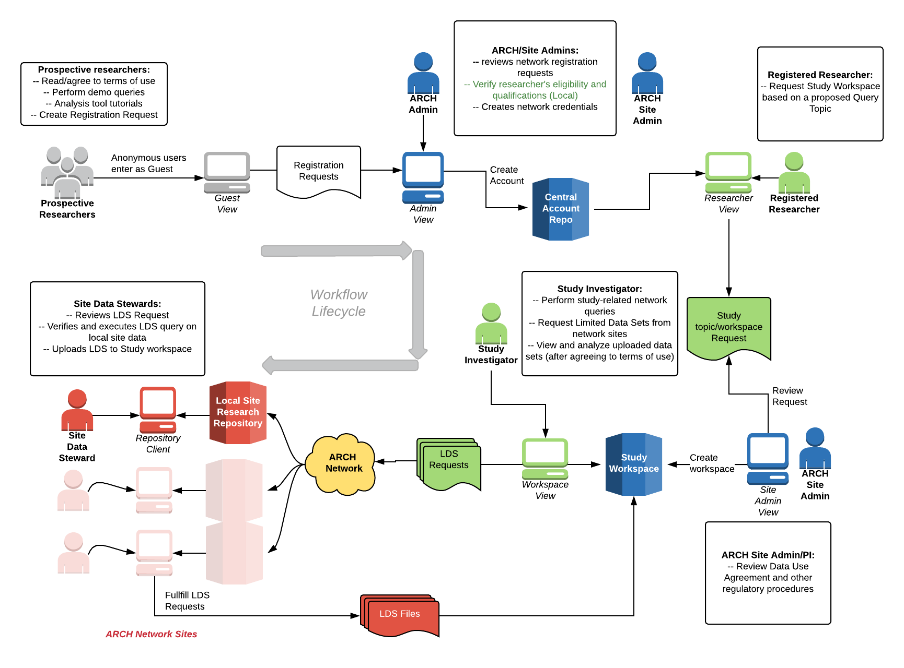
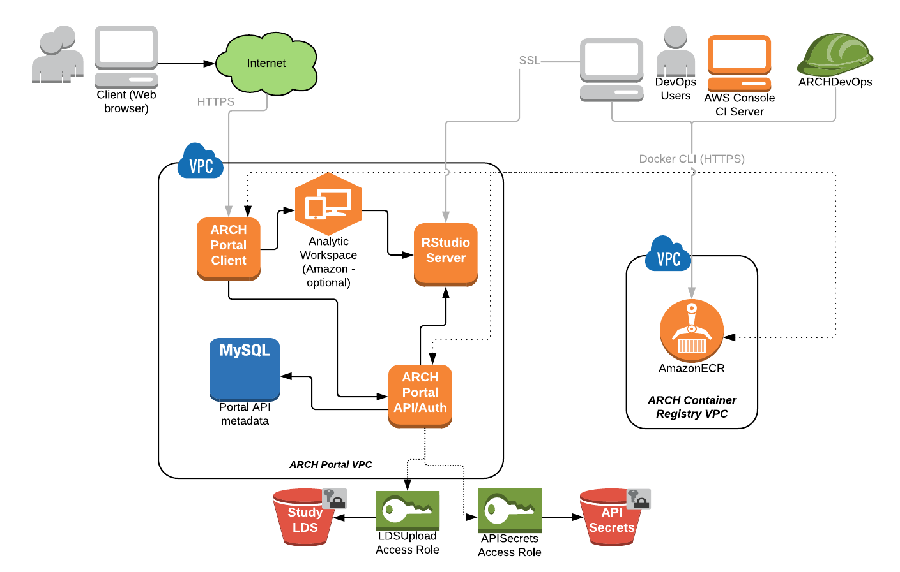

# portal-documentation

This README is a quick start introduction for the ARCH portal.  The ARCH portal is a software project of the [ARCH project](http://arch-commons.org)

## Overview

The ARCH portal is a prototype implementation of the procedural workflow that allows a researcher to request data from a research query across the network,
and subsequently provides sites with a facility to fulfill that request through customizations of open-source tooling.

## Portal componenets

The above diagram provides an infrastructure architecture of the portal's main components.  The current implementation exists in the cloud using AWS resources.
For details about the AWS deployment please go to the [AWS Deployment repository README file](https://github.com/ARCH-commons/arch-portal-cloudformation)

### Portal Client

The web application/main interface for the system.  The application's features vary based on a user's role, where
  * _Guests_ may  request access to become a registered user and view tutorials on how to use the analytic resources
  * _Registered users_ may access the study workspaces they own, as well as request new workspaces.  Each study workspace provides a) access to the SHRINE query tool, 
  using a topic specifically created for that study; b) the ability to make data requests in the network from queries generated from the SHRINE tool;
  and c) access to the fulfilled data requests via the space's analytic tool.
  * _Site Administrators_ may approve or deny registration and study requests for the sites they are responsible for.
  
### Portal API and Authorization Server

The backend service API that manages the portal's users/resources/data sets/etc.  
Also includes a custom OAuth server to provide credentials for web application users and determines authorization status.  
The OAuth server for the prototype is configured to use an i2b2 PM cell to authenticate users.

### Analytic workspace

A workspace provided within each user's study space to do statistical analysis of any data sets that get uploaded to the space in fulfillment of a data request.  In the prototype
this workspace is a iframe into an RStudio Server session (with the 'study' assuming the role of a user).  Uploaded data sets are found in the study's home directory.

### Data storage

The **API metadata database** stores data related to/managed by the portal, including user authorizations, registration and study data, and metadata on uploaded data sets.  Follow [this link for the database schema](portal-schema.sql)

The **Study LDS S3 bucket** stores data sets that get submitted from sites responding to requests from researchers in studies.
The API manages the transfer of these sets from this bucket to the Analytic workspace of the requested study.

### Container registry

The portal's services are deployed as [Docker containers](https://www.docker.com).  A registry was created in the AWS space that stores the latest versions of each service component

## Configuration

Configuration is set in the Docker containers via environment variables that are passed when a service is created.  
Below are the key parameters to set in each service:

### API

| Parameter | Default | Description |
| --- | --- | --- |
| *API_DB_USER* | --- | The database user for the metadata database |
| *API_DB_PASSWORD* | --- | The password for the user above |
| *ARCH_PM_URL* | --- | The URL of the i2b2 PM cell service connection |
| *ARCH_PM_DOMAIN* | --- | The i2b2 domain of the PM cell |
| *AWS_CMK_ID* | --- | the AWS resource ID of the customer-managed KMS key used for encrypting/decrypting portal data |
| *AWS_CMK_REGION* | us-east-1 | the region the *AWS_CMK_ID* was created in |
| *AWS_LDS_BUCKET_NAME* | --- | The S3 bucket used for data set storage |
| *AWS_LDS_BUCKET_REGION* | --- | The region the *AWS_LDS_BUCKET* was created in |
| *DB_CONNECTION_STRING* | --- | The JDBC connection string to the API metadata database |
| *DEPLOY_TYPE* | dev | Type of deployment (dev - staging - prod) |
| *OAUTH_SECRET_KEY* | (a random string) | An arbitrary string used for traffic encryption for Auth Server |

For AWS-based deployments, many of these variables are stored in the __AWS System Manager Parameter Store__.
(For example, if the services are deployed via Amazon ECS.)  In this scenario, the following environment variables would
need to be set as an alternative:
- **AWS_ACCESS_KEY_ID**: The AWS access key id representing a user with access to the environment variables above.
- **AWS_SECRET_ACCESS_KEY**: The secret key associated with the ID above.

### Web application

| Parameter | Default | Description |
| --- | --- | --- |
| *ARCH_API_BASE_URL* | --- | The endpoint for the portal api (e.g. https://api.arch-commons.org/api) |
| *ARCH_MAIN_URL* | http://arch-commons.org | The URL for the ARCH project home page |
| *ARCH_SHRINE_WEBCLIENT_URL* | --- | The URL for the ARCH SHRINE webclient |
| *SHRINE_DEMO_URL* | --- | A URL for a demonstration SHRINE webclient |
| *SSP_BASE_URL* | --- | The Internet-accessible URL endpoint for this application |

## Notes

### Codebase refactoring

There is a partially-completed refactor of the portal's API, Authorization Server and frontend services located in the ARCH-commons GitHub repository at the following locations:
* API and Authorization Server: [https://github.com/ARCH-commons/portal-web-services](https://github.com/ARCH-commons/portal-web-services)
* Web application: [https://github.com/ARCH-commons/portal-frontend](https://github.com/ARCH-commons/portal-frontend) 
**NOTE:** The refactor is located on the 'refactor_Oct2018' branch

The refactor was started with an eye towards making the portal's main components production-ready.  Among the major changes are:
* Platform migration from JEE 6 towards the Spring Framework and child components
* Authentication has been exported to third-party service ([Auth0](https://auth0.com) was the tested platform)
* Refactored web application to a role-based access control strategy using [easy-session](https://github.com/DeadAlready/node-easy-session) and [easy-rbac](https://github.com/DeadAlready/easy-rbac) modules

It is recommended that subsequent developers tasked with taking this codebase to production refer to these repositories first,
as the original prototype was originally intended for demo purposes.